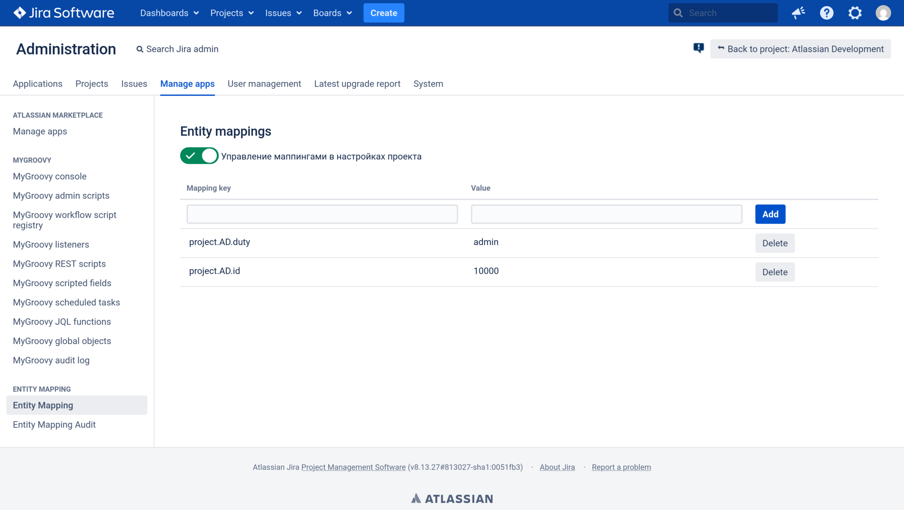
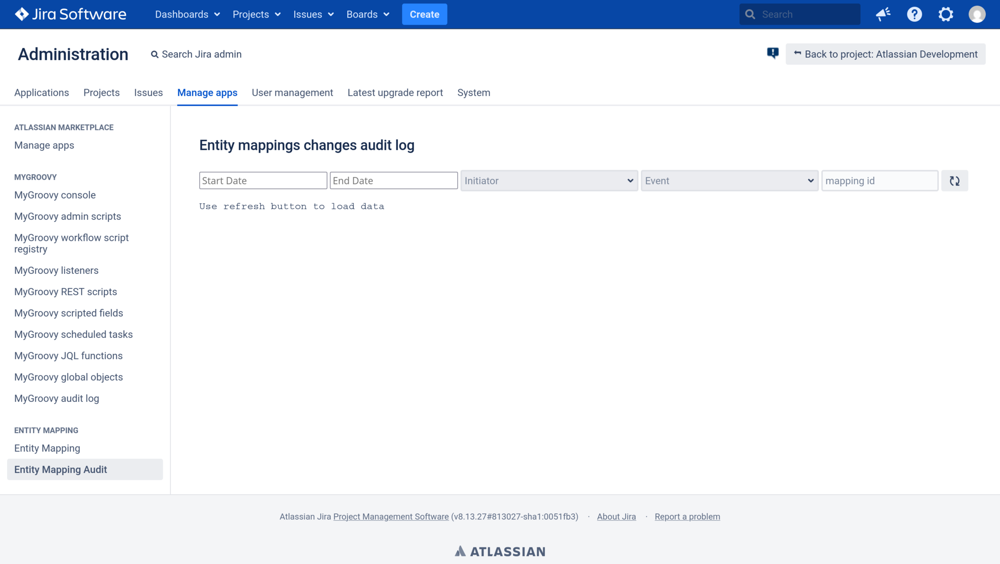
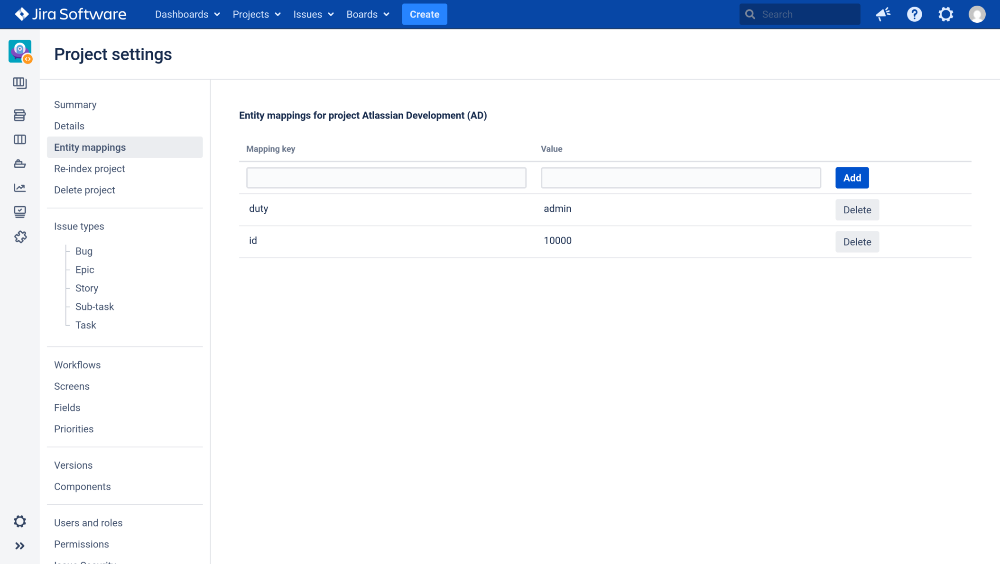

# Entity Mapper

Предоставляет функционал маппинга идентификаторов системных сущностей на ключи.

## Интерфейс настройки



## Интерфейс просмотра журнала событий


## Интерфейс настройки маппингов проекта


Основной кейс использования - вынесение констант, связанных с настройкой автоматизаций, из скриптов (ScriptRunner, MyGroovy).
Так же может применяться для предоставления простого интерфейса конфигурации для плагинов.
Примеры применения можно найти в директории examples.

### Ссылки между ключами

Поддерживает ссылки между ключами. Например:

1. Объявляем маппинг такого вида (определение конкретного пользователя):

   `developmentDepartment.CEO` => `ivan.ivanov@example.org`
2. Используем ранее созданный маппинг в новом:

   `service.jira.support.duty` => `${developmentDepartment.CEO}`

При таком объявлении маппингов при получении значения по ключу `service.jira.support.duty` будет возвращено
значение `ivan.ivanov@example.org`

### Управление маппингами в настройках проекта

Позволяет управлять маппингами в настройках проекта. Возможность может быть включена на основной странице настройки
маппингов.

Для такого управления действуют следующие ограничения:
1. Управление возможно только для тех маппингов, ключи которых имеют префикс `project.PROJECT_KEY`, где `PROJECT_KEY`
соответствует ключу текущего проекта. При этом сам префикс ключей в UI не отображается.
2. Все ключи создаваемых маппингов будут иметь префикс `project.PROJECT_KEY`

На основной странице управления маппингами все ключи отображаются в виде "как есть", т.е. если в настройках проекта AD
создать маппинг:
```text
duty => admin
```
то фактически будет создан маппинг:
```text
project.AD.duty => admin
```
На основной странице управления такой маппинг будет отображаться с ключем `project.AD.duty`.

Это правило действует и в обратную сторону. Если на основной странице управления маппингами создать маппинг:
```text
project.AD.manager => admin
```
то этот маппинг будет отображаться на странице управления маппингами в настройках проекта как
```text
manager => admin
```