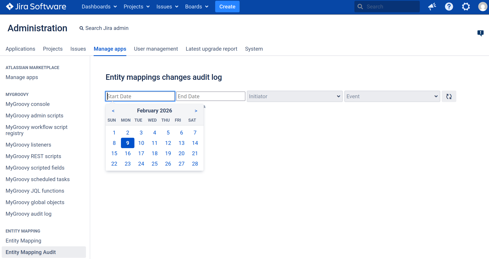

# Entity Mapper

Предоставляет функционал маппинга идентификаторов системных сущностей на ключи.

## Интерфейс настройки


## Интерфейс просмотра журнала событий


## Базовое применение
### Пример использования в плагинах

Для того чтобы использовать entity mapper в своем плагине его нужно подключить к проекту как зависимость. После этого
можно использовать `EntityMapper` так же, как и любой другой сервис (бин).

#### Подключение Entity Mapper-а

Для подключения entity mapper-а к проекту нужно добавить следующую запись в его настройки (pom.xml):
```xml
<project>
    <!-- другие настройки проекта -->
    <dependencies>
        <!-- описание других зависимостей -->
        <dependency>
            <groupId>org.samearch.jira.lib</groupId>
            <artifactId>entity-mapper</artifactId>
            <version>use installed plugin version here</version>
            <scope>provided</scope>
        </dependency>
    </dependencies>
</project>
```
#### Пример кода

`EntityMapper` экспортируется из плагина как сервис Spring и как сервис OSGi. Поэтому для его использования требуется
указание двух аннотаций - `@ComponentImport` и `@Autowired` (первая - инструкция для Atlassian Spring Scanner,
вторая - для Spring Runtime):

```java
import com.atlassian.jira.project.Project;
import com.atlassian.jira.project.ProjectManager;
import com.atlassian.plugin.spring.scanner.annotation.imports.ComponentImport;
import EntityMapper;
import EntityMapping;
import org.slf4j.Logger;
import org.slf4j.LoggerFactory;
import org.springframework.beans.factory.annotation.Autowired;
import org.springframework.stereotype.Component;

import java.util.Optional;

@Component
public class SomeService {

    /** Ключ, по которому в интерфейсе настроек должен быть указан идентификатор проекта. */
    private static final String PROJECT_ATLASSIAN_DEV_ID_KEY = "project.ATLASSIAN_DEV.id";

    /** Ключ, по которому лежит шаблон сообщения об ошибке в случае отсутствия необходимого маппинга. */
    private static final String PROJECT_EXPECTED_ERROR_MESSAGE_KEY = "message.error.projectExpected";
    /** Шаблон сообщения об ошибке об отсутствующем маппинге, который будет использован в случае, когда кастомный шаблон не определен. */
    private static final String PROJECT_EXPECTED_ERROR_MESSAGE_DEFAULT = "Для корректной работы плагина нужен идентификатор проекта с ключом %s";

    private static final Logger LOG = LoggerFactory.getLogger(SomeService.class);

    /*
     * Т.к. используется сервис из стороннего плагина, то требуется соответствующая запись в секции импорта манифеста OSGi.
     * Директива @ComponentImport сообщает об этом Atlassian Spring Scanner-у, который добавит необходимую запись в
     * манифест во время сборки текущего плагина.
     */
    @ComponentImport
    private final EntityMapper entityMapper;

    /* Стандартные компоненты Jira */
    @ComponentImport
    private final ProjectManager projectManager;

    @Autowired // стандартная аннотация Spring

    public SomeService(EntityMapper entityMapper, ProjectManager projectManager) {
        this.entityMapper = entityMapper;
        this.projectManager = projectManager;
    }

    /*
     * Порядок действий:
     * 1. Получаем сохраненное значение для заранее описанного ключа.
     * 2. Проверяем, что сохраненное значение существует.
     * 3. Т.к. ожидаем, что администратор системы записал по ключу идентификатор проекта - парсим его из строки в число.
     *    При этом не забываем, что администратор мог ввести некорретные данные (например, вместо идентификатора проекта
     *    его ключ).
     * 4. Вызываем стандартный ProjectManager для получения объекта интересующего проекта.
     *
     * Если по какой-то причине не удалось определить проект - выводим сообщение об ошибке.
     */
    public void someMethod() {
        Optional<EntityMapping> atlasDevProjectIdHolder = entityMapper.getMapping(PROJECT_ATLASSIAN_DEV_ID_KEY);

        if (!atlasDevProjectIdHolder.isPresent()) {
            String errorMessageTemplate = entityMapper.getMappedValue(PROJECT_EXPECTED_ERROR_MESSAGE_KEY)
                    .orElse(PROJECT_EXPECTED_ERROR_MESSAGE_DEFAULT);
            String errorMessage = String.format(errorMessageTemplate, PROJECT_ATLASSIAN_DEV_ID_KEY);
            LOG.error(errorMessage);
            return;
        }

        String atlasDevProjectIdMappedValue = atlasDevProjectIdHolder.get();
        try {
            long atlasDevProjectId = Long.parseLong(atlasDevProjectIdMappedValue);
            Project atlasDevProject = projectManager.getProjectObj(atlasDevProjectId);
            if (atlasDevProject != null) {
                // здесь можно что-то делать с объектом atlasDevProject
            }
        } catch (NumberFormatException e) {
            LOG.error("Bad project id: #{}. (mapped in key {})", atlasDevProjectIdMappedValue, PROJECT_ATLASSIAN_DEV_ID_KEY);
        }
    }
}
```
## Jira Entity Mapping Helper

Кроме базовой функциональности маппинга плагин предоставляет хелпер, позволяющий получить готовые сущности Jira по их
замапленным идентификаторам - `JiraEntityMappingHelper`. Этот класс является расширением EntityMapper-а и может быть
использован в качестве его замены.

### Пример использования хелпера для работы с сущностями Jira

Предыдущий пример кода с использованием хелпера можно переписать в таком виде:

```java
import com.atlassian.jira.project.Project;
import com.atlassian.plugin.spring.scanner.annotation.imports.ComponentImport;
import JiraEntityMappingHelper;
import org.springframework.beans.factory.annotation.Autowired;
import org.springframework.stereotype.Component;

import java.util.Optional;

@Component
public class SomeService {

    /** Ключ, по которому в интерфейсе настроек должен быть указан идентификатор проекта. */
    private static final String PROJECT_ATLASSIAN_DEV_ID_KEY = "project.ATLASSIAN_DEV.id";
    /** Ключ, по которому лежит шаблон сообщения об ошибке в случае отсутствия необходимого маппинга. */
    private static final String PROJECT_EXPECTED_ERROR_MESSAGE_KEY = "message.error.projectExpected";
    /** Шаблон сообщения об ошибке об отсутствующем маппинге, который будет использован в случае, когда кастомный шаблон не определен. */
    private static final String PROJECT_EXPECTED_ERROR_MESSAGE_DEFAULT = "Для корректной работы плагина нужен идентификатор проекта с ключом %s";

    private static final Logger LOG = LoggerFactory.getLogger(SomeService.class);

    @ComponentImport
    private final JiraEntityMappingHelper jiraEntityMapper;

    @Autowired
    public SomeService(JiraEntityMappingHelper jiraEntityMapper) {
        this.jiraEntityMapper = jiraEntityMapper;
    }

    /*
     * Порядок действий:
     * 1. Получаем объект проекта Jira идентификатор которого доступен по заранее записанному ключу.
     *
     * Если по какой-то причине не удалось определить проект - выводим сообщение об ошибке.
     */
    public void someMethod() {
        Optional<Project> atlasDevProjectHolder = jiraEntityMapper.getMappedProjectById(PROJECT_ATLASSIAN_DEV_ID_KEY);

        if (!atlasDevProjectHolder.isPresent()) {
            String errorMessageTemplate = jiraEntityMapper.getMappedValue(PROJECT_EXPECTED_ERROR_MESSAGE_KEY)
                    .orElse(PROJECT_EXPECTED_ERROR_MESSAGE_DEFAULT);
            String errorMessage = String.format(errorMessageTemplate, PROJECT_ATLASSIAN_DEV_ID_KEY);
            LOG.error(errorMessage);
            return;
        }

        Project atlasDevProject = atlasDevProjectHolder.get();
        // дальше можно что-то делать с объектом atlasDevProject
    }
}
```

### Пример использования хелпера для работы с сущностями Jira в ScriptRunner

_Проверен на Jira 7.1.4 со ScriptRunner 5.1.6.2_

Пост-функция, сохраняющая проект, в котором была создана задача, в пользовательское поле.

Пост-функция добавляется на переход создания задачи.

Предварительно нужно создать пользовательское поле типа Project Picker (single project)
и добавить запись с его идентификатором в Entity Mapper с ключем `wf.INITIAL_PROJECT_CF.id`.

Так же его нужно добавить на экран создания и просмотра задачи.

```groovy
import com.onresolve.scriptrunner.runner.customisers.PluginModule
import com.onresolve.scriptrunner.runner.customisers.WithPlugin

import org.samearch.jira.lib.entity.mapper.JiraEntityMappingHelper

import com.atlassian.jira.project.Project
import com.atlassian.jira.issue.fields.CustomField

@WithPlugin("org.samearch.jira.lib.entity-mapper")
@PluginModule
JiraEntityMappingHelper emHelper

final String CF_INITIAL_PROJECT_ID = "wf.INITIAL_PROJECT_CF.id"

Project currentProject = issue.projectObject

CustomField initialProjectCf = emHelper.getMappedCustomFieldById(CF_INITIAL_PROJECT_ID)
    .orElseThrow { new RuntimeException("Initial project field not configured") }

initialProjectCf.createValue(issue, currentProject)
```
